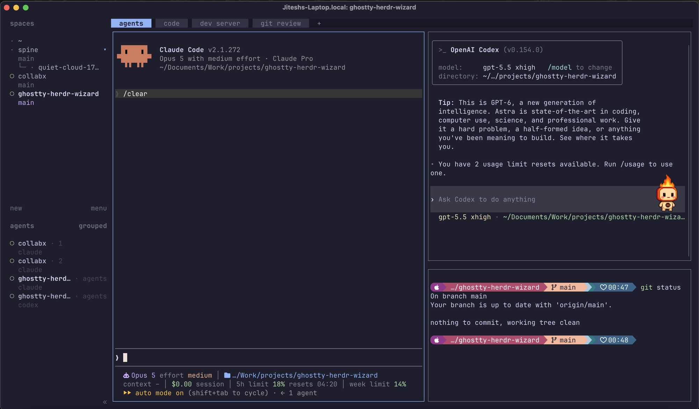

# ghostty-herdr-wizard

**One bash script sets up a Mac terminal that runs your coding agents.**

The script installs and configures the terminal, the tools and the agent integrations. It then shows you how to use them.
test change
After it runs, you can:

- keep every repo open in the same window, and move between them with one key
- run Claude Code and Codex next to each other, and see which agent waits for you
- get a macOS notification when an agent finishes or needs an answer
- close the terminal without stopping your agents, tests or dev servers
- read code, review diffs and commit, without a browser or an editor window

[Ghostty](https://ghostty.org) is the terminal. [herdr](https://herdr.dev) keeps the sessions running in the background.



## The screen, part by part

- **Spaces (top left).** Each repo is one workspace. Select a repo to go to it. The `spine` repo also shows a git worktree. A second agent works there on a different branch.
- **Agents (bottom left).** This list shows all agents in all repos. A mark on each row tells you if the agent works, waits for you, or is idle.
- **Tabs (top).** This repo has four tabs: `agents`, `code`, `dev server` and `git review`. Each repo keeps its own tabs.
- **Claude Code (large pane).** The two lines at the bottom show the model, the effort, the folder, the context used, the cost of the session, and your 5-hour and weekly limits.
- **Codex (top right).** A second agent works in the same repo.
- **Shell (bottom right).** The prompt shows the folder, the git branch and the time.

If you close Ghostty, the agents continue. When you open Ghostty again, your layout comes back. It also comes back after you restart the Mac.

## Install

You need a Mac and [Homebrew](https://brew.sh). Run these commands:

```bash
git clone https://github.com/jiteshy/ghostty-herdr-wizard.git
cd ghostty-herdr-wizard
bash ghostty-herdr-wizard.sh
```

The setup takes 20 to 30 minutes. Most of that time is downloads.

You can run the script again at any time. It does not repeat work that is complete.

```bash
bash ghostty-herdr-wizard.sh --list                # show the steps by name
bash ghostty-herdr-wizard.sh --skip yazi,github    # do not do these steps
bash ghostty-herdr-wizard.sh --from editor         # start at the editor step
bash ghostty-herdr-wizard.sh --only statusline     # do only this step
bash ghostty-herdr-wizard.sh --tour                # do the tour again
bash ghostty-herdr-wizard.sh --revert              # undo every config change
```

## What the script does

The script has 13 steps. Each step has a name, tells you what it will do, and waits for you.

The script does three types of work:

1. It installs software with Homebrew.
2. It writes config files. If a file exists and is different, the script shows you the changes and asks you first. It keeps a copy of the old file in `~/.ghostty-herdr-wizard/backups/`.
3. It tells you what to do for the steps that need a person. Examples: approve a macOS permission, or sign in to GitHub.

**`choices`.** All the questions come first: icons (installs the JetBrains Mono Nerd Font) or plain text, which works in any font, so nothing shows as boxes in a terminal without a Nerd Font; the folder with your repos; and the tabs that new workspaces open with. The answers are saved, and the next run offers to use them again.

**`install`.** Install everything with Homebrew in one go: Ghostty, herdr and all the tools below. Tools you skip with `--skip` are not installed.

**`ghostty`, `herdr`, `macos`: the terminal and the agents.** Write the Ghostty config: the Catppuccin Mocha dark theme, Cmd keys that control herdr, and herdr in every new window. Make the Ctrl-Space key free for herdr, write its config, and connect Claude Code and Codex to it, so their conversations continue after a restart. Set up notifications and the quick terminal.

**`prompt`, `shell`: the shell.** Set up the Starship prompt. Add history search, aliases for `bat`, `eza`, `fzf` and the other command-line tools, and a command that finds and opens your repos.

**`editor`, `review`, `yazi`, `github`: code and git.** Neovim with LazyVim, `delta` and `difftastic` for clear diffs, `lazygit` to stage and commit, `yazi` to browse files, and the GitHub CLI with `gh-dash` for pull requests.

**`statusline`.** Add the Claude Code status line.

**`tour`.** Nine short screens. You open repos, start agents, split panes, let Claude change a file, review the change, and close and resume everything. The tour teaches you the keys while you use them. Type `keys` later to see the full list.

## Thanks

1. Matt Pocock's [wizard skill](https://www.aihero.dev/skills-wizard) made this script. The skill makes a coding agent write a setup wizard for you. The template comes from [his skills collection](https://github.com/mattpocock/skills). See [THIRD_PARTY_NOTICES.md](THIRD_PARTY_NOTICES.md).

2. [Harshal Tripathi](https://github.com/harshalstory) for the inspiration to explore ghostty & herdr.

## License

[MIT](LICENSE)
